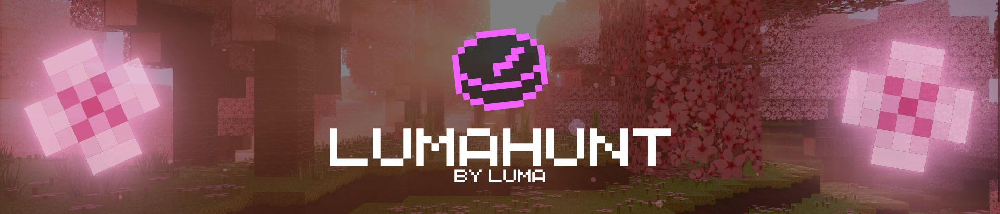

A Minecraft mod that integrates Manhunt-style game mechanics directly into the client, featuring a custom lobby system, role management, and easy game setup.

_If you have any issues, **PLEASE** report them on our [GitHub Issues](https://github.com/LumaBlossom/LumaHunt/issues) page._

## 🎮 Game Modes

- **Manhunt**: Play Manhunt-style game mechanics directly in the client. ( Like in Dream videos )

## 🏰 Lobby System

- **Role Management**: easily assign roles to players via a right-click context menu:
  - **👟 Runner**: The target who must beat the game.
  - **⚔️ Hunter**: The players trying to stop the Runner.
  - **👁️ Spectator**: Observers of the match.
- **Code Sharing**: Host can reveal and copy the lobby code to share with friends.

## ⚙️ Customization

- **Start Modes**:
  - **DreamStart**: Classic Manhunt start.
  - **Headstarts**: Configurable timed headstarts for the Runner ( 10s, 30s, 1m, etc. ).
- **Lobby Settings**: Adjust maximum player counts ( up to 20 ).
- **Custom UI**: A custom-themed, cool & modern interface.

## 📥 Installation

1. Install **[Fabric Loader](https://fabricmc.net/)**.
2. Download the **LumaHunt** mod `.jar` file.
3. Install **[Fabric API](https://modrinth.com/mod/fabric-api)** ( Required ).
4. Place both files into your `.minecraft/mods` folder.
5. _(Optional)_ Install **[Mod Menu](https://modrinth.com/mod/modmenu)** to configure settings.

## 🛠️ Configuration

Access the settings menu from the LumaHunt Lobby to configure:

- **Runner Headstart**: Time given to the Runner before Hunters are released.
- **Max Players**: Limit the number of players in your lobby.

_Code for tunneling was used from [e4mc](https://modrinth.com/mod/e4mc) Thanks [vgskye](https://modrinth.com/user/vgskye) for creating this best mod to play with friends!_

_Created by [LumaBlossom](https://modrinth.com/organization/LumaBlossom)_
